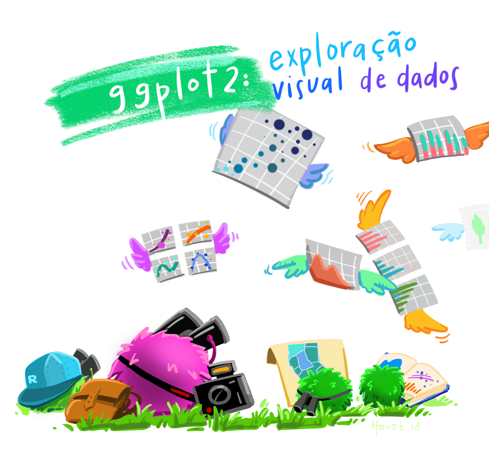
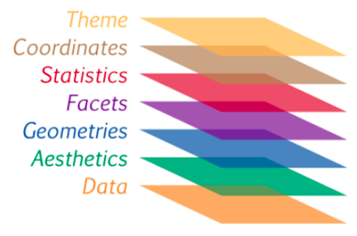
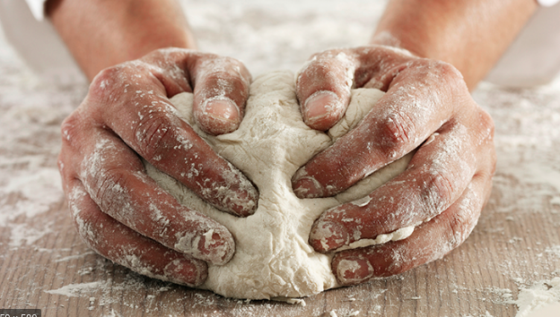
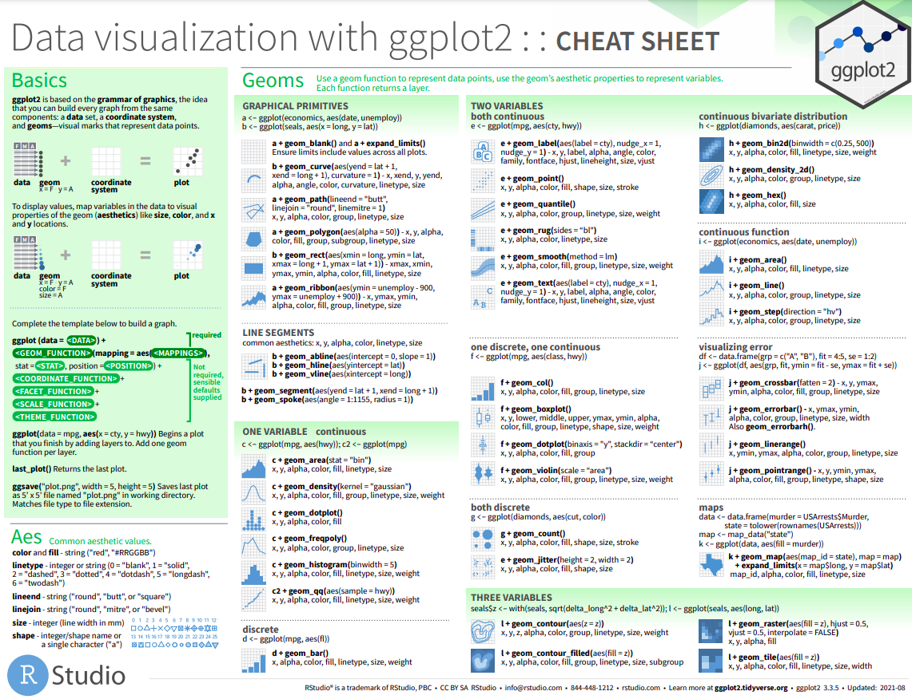

layout: true
  
<div class="my-footer"><span>


<a href="https://www.meetup.com/pt-BR/R-Ladies-Sao-Paulo">Meetup</a> |
<a href="https://twitter.com/RLadiesSaoPaulo">Twitter</a> | 
<a href="http://instagram.com/RLadiesSaoPaulo">Instagram</a> |
<a href="http://facebook.com/RLadiesSaoPaulo">Facebook</a> |
<a href="https://github.com/rladies/meetup-presentations_sao-paulo">GitHub</a> |
<a href="https://www.youtube.com/channel/UCU3ePTnZQurDkYgPK61DAOw">YouTube</a>


</span></div> 
---
class:

```{r setup, include=FALSE}
options(htmltools.dir.version = FALSE)
knitr::opts_chunk$set(fig.align = "center", message=FALSE, warning=FALSE)
library(tidyverse)
```

# Programação

**Princípios de Dataviz com R e ggplot2**

- 19/out: Introdução do pacote `ggplot2`

- 20/out: Explorando gráficos com `ggplot2`

- 21/out: Storytelling com dados


```{r echo=FALSE, , fig.cap="Art by <a href='https://github.com/allisonhorst/stats-illustrations'>Allison Horst</a>", out.width="35%", fig.show='hold',fig.align='center'}
knitr::include_graphics(c("img/horst/ggplot2_exploracao_pt.png"))
```

---
class:

# Hoje

**Introdução do pacote `ggplot2`**

- Instalação do pacote `ggplot2` 

- Lógica e estrutura básica de montagem de um gráfico no `ggplot` 

- Camadas de um gráfico

```{r echo=FALSE, , fig.cap="Art by <a href='https://github.com/allisonhorst/stats-illustrations'>Allison Horst</a>", out.width="35%", fig.show='hold',fig.align='center'}
#knitr::include_graphics(c("img/horst/ggplot2_exploracao_pt.png", "img/horst/ggplot2_obra_prima_pt.png"))

```

---
class:

# Pré-requisitos

## `R` e `RStudio` instalados no seu notebook 

```{r, echo=FALSE, out.width="40%"}
knitr::include_graphics("img/rlogos/rstudio-r.jpg")
```

- Instale o R [fazendo o download aqui](https://cran.r-project.org/) e o RStudio [aqui](https://rstudio.com/products/rstudio/download/#download).

- Passo a passo da instalação (livro Curso-R) [aqui](https://livro.curso-r.com/1-instalacao.html)

---
class:

# R-Studio

RStudio é a **IDE** (integrated development environment) da Linguagem R, ou seja, o ambiente que utilizamos para editar e executar os códigos em R. Tem quatro áreas, conforme a figura abaixo:

```{r, echo=FALSE, out.width="80%", fig.cap="Fonte: <a href='https://github.com/MaryMS/2018-11-R-Course-FatecZS'>Curso Introdução ao R - Fatec</a>"}
knitr::include_graphics("img/intro-rstudio/RStudio_screen.png")
```

---
class: center, middle, inverse

# Vamos começar?

<!-- - instalar o ggplot2 (e tidyverse) -->
<!-- - explicar como o ggplot2 funciona -->
<!-- - exemplos ggplot2 -->


---
class: 

# O que é o ggplot2?
Pacote para visualização de dados, criado por [Hadley Wickham](https://github.com/hadley) e mantido pela [RStudio](https://rstudio.com/).

Referência: livro [Elegant Graphics for Data Analysis](https://ggplot2-book.org/index.html), do Hadley Wickham.

### Por que usar o ggplot2 para montar minhas visualizações?

- Versátil e Esteticamente rico.

- Implementação dos conceitos de *Grammar of Graphics*.


```{r echo=FALSE, , fig.cap="Art by <a href='https://github.com/allisonhorst/stats-illustrations'>Allison Horst</a>", out.width="35%", fig.show='hold',fig.align='center'}
#knitr::include_graphics(c("img/horst/ggplot2_exploracao_pt.png", "img/horst/ggplot2_obra_prima_pt.png"))
knitr::include_graphics("img/horst/ggplot2_obra_prima_pt.png")
```
---
class: 

# Grammar of Graphics

- A origem do nome **GG**plot

- Estrutura que segue uma abordagem em camadas para descrever e construir visualizações ou gráficos de maneira estruturada.

- Uma visualização geralmente tem vários componentes ou aspectos, e alavancar essa gramática de gráficos em camadas nos ajuda a descrever e entender cada componente envolvido na visualização - em termos de dados, estética, escala, objetos e assim por diante.

```{r echo=FALSE, out.width="20%"}
knitr::include_graphics("img/rlogos/hex-ggplot2.png")
```

---
class: 

# Sintaxe básica do ggplot

- Um gráfico feito com ggplot2 é uma soma de **camadas**.

- Não precisa utilizar todos os componentes seguintes em seu gráfico, mas é interessante saber que existem.

<BR>

```{r echo=FALSE, out.width="45%"}

```

---
class: 

# Sintaxe básica do ggplot

- A função `ggplot()` inicia um gráfico ggplot.

- Utilizamos o símbolo **`+`** para somar as camadas.

```{r echo=FALSE, out.width="45%"}

```

```
 ggplot(data, aesthetics) +
    geometries(statistics) +
    facets +
    coordinates +
    theme
```
---
class: 

# Construção de um gráfico

1. **Base de dados** que temos interesse em analisar e extrair informação.

---
class: 

# Construção de um gráfico

1. **Base de dados** que temos interesse em analisar e extrair informação.

2. **Mapear as variáveis** que queremos relacionar.

---
class: 

# Construção de um gráfico

1. **Base de dados** que temos interesse em analisar e extrair informação.

2. **Mapear as variáveis** que queremos relacionar.
  
3. Definir o **objeto geométrico** mais adequado: linha, ponto, barras etc.


---
class: 

# Construção de um gráfico

1. **Base de dados** que temos interesse em analisar e extrair informação.

2. **Mapear as variáveis** que queremos relacionar.
  
3. Definir o **objeto geométrico** mais adequado: linha, ponto, barras etc.

<BR>
<BR>

```
ggplot(data = [BASE DE DADOS], 
       mapping = aes(x = [VARIÁVEL X], y = [VARIÁVEL Y])) +
  geom_[OBJETO GEOMÉTRICO]()
```

---
class: 

# Objetos geométricos

- Gráficos de dispersão: `geom_point()`

- Gráficos de barras: `geom_col()` ou `geom_bar()`

- Gráficos de linhas: `geom_line()`

- Histograma: `geom_hist()`

- Boxplot: `geom_boxplot()`

- Densidade: `geom_density()`

- Suavização: `geom_smooth()`

- Adicionar rótulos ou textos: `geom_label()` ou `geom_text()`

---
class: 

# Mão na massa

```{r echo=FALSE, out.width="30%"}

```

Primeiro, precisamos instalar os pacotes necessários e carregá-los:
  - Pacote `dplyr` para manuseio dos dados.
  - Pacote `ggplot2` para a visualização dos dados.
  
```{r, cache=FALSE}
# install.packages('dplyr')
# install.packages('ggplot2')

library(ggplot2)
library(dplyr)
```

---
class: 

# Mão na massa

#### Selecionar a base de dados

- Na maioria das vezes precisaremos organizar e limpar os dados antes de utilizar o ggplot. Aqui vamos partir de uma base já organizada.

- Para a parte prática, utilizaremos a base do R *airquality*.

```{r}
# Leitura da base de dados
airquality <- as_tibble(datasets::airquality)
head(airquality)
```

---
class: 

# Mão na massa

#### Mapear as variáveis

As variáveis escolhidas para a minha análise são: **Wind** e **Temp**.

```{r}
select(airquality, Wind, Temp)
```

---
class: 

# Mão na massa

#### Definir objeto geométrico

Como as variáveis **Wind** e **Temp** são numéricas, vamos fazer um gráfico de pontos, chamando a camada `geom_point()`.

---
class: 

# Mão na massa

1. **Base de dados**: airquality.

2. **Mapear as variáveis**: Wind (x) e Temp (y).
  
3. **Objeto geométrico**: pontos (`geom_point()`).

<BR>

```{r, echo=TRUE, fig.show="hide", collapse=T, out.width="80%"}
ggplot(data = airquality,
       mapping = aes(x = Wind, y = Temp)) +
  geom_point() # Camada 1
```
---
class: 

# Mão na massa

```{r, eval=TRUE, echo=FALSE, collapse=T, out.width="55%"}
ggplot(data = airquality,
       mapping = aes(x = Wind, y = Temp)) +
  geom_point()
```

---
class: 

# Mão na massa

O mapeamento das variáveis também pode ser inserido no objeto geométrico:

```{r, echo=TRUE, collapse=T, out.width="45%"}
ggplot(data = airquality) +
  geom_point(mapping = aes(x = Wind, y = Temp))
```

---
class: 

# Mão na massa

#### Como podemos melhorar?

<BR>
<BR>

```{r echo=FALSE, , fig.cap="Art by <a href='https://github.com/allisonhorst/stats-illustrations'>Allison Horst</a>", out.width="45%", fig.show='hold',fig.align='center'}
#knitr::include_graphics(c("img/horst/ggplot2_exploracao_pt.png", "img/horst/ggplot2_obra_prima_pt.png"))
knitr::include_graphics("img/horst/ggplot2_obra_prima_pt.png")
```

---
class: 

# Mão na massa

#### Como podemos melhorar?

- Títulos e subtítulos
- Nomear eixos
- Cores e tamanhos dos objetos geométricos
- Temas

---
class: 

# Mão na massa

#### Cores e tamanhos dos objetos geométricos

- Caso 1: meramente estéticos
- Dentro do objeto geométrico (`geom_point()`)
- Cor: `geom_point(color = "cor desejada")`
- Tamanho dos pontos `geom_point(size = valor numérico)`

```{r, eval=FALSE, echo=TRUE, collapse=T, out.width="40%"}
ggplot(data = airquality,
       mapping = aes(x = Wind, y = Temp)) +
  geom_point(color = "blue", size = 4)  # Camada 1
```

---
class: 

# Mão na massa

#### Cores e tamanhos dos objetos geométricos

```{r, eval=TRUE, echo=FALSE, collapse=T, out.width="50%"}
ggplot(data = airquality,
       mapping = aes(x = Wind, y = Temp)) +
  geom_point(color = "blue", size = 4)  # Camada 1
```

---
class: 

# Mão na massa

#### Cores e tamanhos dos objetos geométricos

- Caso 2: associados a uma terceira variável: `aes()` (mapeamento das variáveis)
- Dentro do objeto geométrico (`geom_point()`)
- Cor: `geom_point(color = variável)`
- Tamanho dos pontos `geom_point(size = variável)`

Vou associar a cor à variável **Month** (numérico de 5 a 9)

```{r, eval=FALSE, echo=TRUE, collapse=T, out.width="50%"}
ggplot(data = airquality) +
  geom_point(mapping = aes(x = Wind, y = Temp, color = factor(Month)), size = 2)  # Camada 1
```

---
class: 

# Mão na massa

#### Cores e tamanhos dos objetos geométricos

```{r, eval=TRUE, echo=FALSE, collapse=T, out.width="50%"}
ggplot(data = airquality) +
  geom_point(mapping = aes(x = Wind, y = Temp, color = factor(Month)), size = 2)   # Camada 1
```

---
class: 

# Mão na massa

#### Cores e tamanhos dos objetos geométricos

```{r, eval=TRUE, echo=FALSE, collapse=T, out.width="50%"}
ggplot(data = airquality) +
  geom_point(mapping = aes(x = Wind, y = Temp, size = factor(Month), color = factor(Month)))  # Camada 1
```

---
class: 

# Mão na massa

#### Cores e tamanhos dos objetos geométricos

```{r, eval=FALSE, echo=TRUE, collapse=T, out.width="50%"}
ggplot(data = airquality) +
  geom_point(mapping = aes(x = Wind, y = Temp, size = factor(Month), color = factor(Month)))  # Camada 1
```

---
class: 

# Mão na massa

#### Títulos e subtítulos

- Nova camada: `ggtitle("Titulo", "subtítulo")`.

```{r, eval=FALSE, echo=TRUE, collapse=T, out.width="40%"}
ggplot(data = airquality) +
  geom_point(mapping = aes(x = Wind, y = Temp, size = factor(Month), color = factor(Month))) + # Camada 1
  ggtitle("Qualidade do ar", "Temperatura pelo Vento")  # Camada 2
```

---
class: 

# Mão na massa

#### Títulos e subtítulos

```{r, eval=TRUE, echo=FALSE, collapse=T, out.width="50%"}
ggplot(data = airquality) +
  geom_point(mapping = aes(x = Wind, y = Temp, size = factor(Month), color = factor(Month))) + # Camada 1
  ggtitle("Qualidade do ar", "Temperatura pelo Vento")  # Camada 2
```

---
class: 

# Mão na massa

#### Eixos

- Nova camada: `labs(x = "nome no eixo x", y = "nome no eixo y")`.

```{r, eval=FALSE, echo=TRUE, collapse=T, out.width="40%"}
ggplot(data = airquality) +
  geom_point(mapping = aes(x = Wind, y = Temp, size = factor(Month), color = factor(Month))) + # Camada 1
  ggtitle("Qualidade do ar", "Temperatura pelo Vento") +  # Camada 2
  labs(x = "Vento (Km/h)", y = "Temperatura (Farenheit)") # Camada 3
```

---
class: 

# Mão na massa

#### Eixos

```{r, eval=TRUE, echo=FALSE, collapse=T, out.width="50%"}
ggplot(data = airquality) +
  geom_point(mapping = aes(x = Wind, y = Temp, size = factor(Month), color = factor(Month))) + # Camada 1
  ggtitle("Qualidade do ar", "Temperatura pelo Vento") +  # Camada 2
  labs(x = "Vento (Km/h)", y = "Temperatura (Farenheit)") # Camada 3
```

---
class: 

# Mão na massa

#### Eixos

- Alterar limites das coordenadas: `xlim(c(a,b))` e `ylim(c(a,b))`.

```{r, eval=FALSE, echo=TRUE, collapse=T, out.width="40%"}
ggplot(data = airquality) +
  geom_point(mapping = aes(x = Wind, y = Temp, size = factor(Month), color = factor(Month))) + # Camada 1
  ggtitle("Qualidade do ar", "Temperatura pelo Vento") +  # Camada 2
  labs(x = "Vento (Km/h)", y = "Temperatura (Farenheit)") + # Camada 3
  xlim(c(0,30)) + # Camada 4
  ylim(c(50,150)) # Camada 5
```

---
class: 

# Mão na massa

#### Eixos

```{r, eval=TRUE, echo=FALSE, collapse=T, out.width="50%"}
ggplot(data = airquality) +
  geom_point(mapping = aes(x = Wind, y = Temp, size = factor(Month), color = factor(Month))) + # Camada 1
  ggtitle("Qualidade do ar", "Temperatura pelo Vento") +  # Camada 2
  labs(x = "Vento (Km/h)", y = "Temperatura (Farenheit)") + # Camada 3
  xlim(c(0,30)) + # Camada 4
  ylim(c(50,150)) # Camada 5
```

---
class: 

# Mão na massa

#### Legenda

- Nova camana: `guides()`.
- Associar com o tipo de representação: cor

```{r, eval=FALSE, echo=TRUE, collapse=T, out.width="40%"}
ggplot(data = airquality) +
  geom_point(mapping = aes(x = Wind, y = Temp, color = factor(Month)), size = 3) + # Camada 1
  ggtitle("Qualidade do ar", "Temperatura pelo Vento") +  # Camada 2
  labs(x = "Vento (Km/h)", y = "Temperatura (Farenheit)") + # Camada 3
  guides(color=guide_legend(title="Mês")) # Camada 3
```

---
class: 

# Mão na massa

#### Legenda

```{r, eval=TRUE, echo=FALSE, collapse=T, out.width="50%"}
ggplot(data = airquality) +
  geom_point(mapping = aes(x = Wind, y = Temp, color = factor(Month)), size = 3) + # Camada 1
  ggtitle("Qualidade do ar", "Temperatura pelo Vento") +  # Camada 2
  labs(x = "Vento (Km/h)", y = "Temperatura (Farenheit)") + # Camada 3
  guides(color=guide_legend(title="Mês")) # Camada 3
```

---
class: 

# Mão na massa

#### Temas

- Alterar temas dos gráficos: `theme_()`.
- Muitos temas!

*Tema clássico*

```{r, eval=FALSE, echo=TRUE, collapse=T, out.width="40%"}
ggplot(data = airquality) +
  geom_point(mapping = aes(x = Wind, y = Temp, color = factor(Month)), size = 3) + # Camada 1
  ggtitle("Qualidade do ar", "Temperatura pelo Vento") +  # Camada 2
  labs(x = "Vento (Km/h)", y = "Temperatura (Farenheit)") + # Camada 3
  guides(color=guide_legend(title="Mês")) + # Camada 3
  theme_classic()  # Camada 4
```

---
class: 

# Mão na massa

#### Temas | Clássico

```{r, eval=TRUE, echo=FALSE, collapse=T, out.width="50%"}
ggplot(data = airquality) +
  geom_point(mapping = aes(x = Wind, y = Temp, color = factor(Month)), size = 3) + # Camada 1
  ggtitle("Qualidade do ar", "Temperatura pelo Vento") +  # Camada 2
  labs(x = "Vento (Km/h)", y = "Temperatura (Farenheit)") + # Camada 3
  guides(color=guide_legend(title="Mês")) + # Camada 3
  theme_classic()  # Camada 4
```

---
class: 

# Mão na massa

#### Temas | Clássico / Tamanho da fonte

```{r, eval=FALSE, echo=TRUE, collapse=T, out.width="40%"}
ggplot(data = airquality) +
  geom_point(mapping = aes(x = Wind, y = Temp, color = factor(Month)), size = 3) + # Camada 1
  ggtitle("Qualidade do ar", "Temperatura pelo Vento") +  # Camada 2
  labs(x = "Vento (Km/h)", y = "Temperatura (Farenheit)") + # Camada 3
  guides(color=guide_legend(title="Mês")) + # Camada 3
  theme_classic(16)  # Camada 4
```

---
class: 

# Mão na massa

#### Temas | Clássico / Tamanho da fonte

```{r, eval=TRUE, echo=FALSE, collapse=T, out.width="50%"}
ggplot(data = airquality) +
  geom_point(mapping = aes(x = Wind, y = Temp, color = factor(Month)), size = 3) + # Camada 1
  ggtitle("Qualidade do ar", "Temperatura pelo Vento") +  # Camada 2
  labs(x = "Vento (Km/h)", y = "Temperatura (Farenheit)") + # Camada 3
  guides(color=guide_legend(title="Mês")) + # Camada 3
  theme_classic(16)  # Camada 4
```


---
class: 

# Mão na massa

#### Temas

- Alterar temas dos gráficos: `theme_()`.
- Muitos temas!

*Tema escuro*

```{r, eval=FALSE, echo=TRUE, collapse=T, out.width="40%"}
ggplot(data = airquality) +
  geom_point(mapping = aes(x = Wind, y = Temp, color = factor(Month)), size = 3) + # Camada 1
  ggtitle("Qualidade do ar", "Temperatura pelo Vento") +  # Camada 2
  labs(x = "Vento (Km/h)", y = "Temperatura (Farenheit)") + # Camada 3
  guides(color=guide_legend(title="Mês")) + # Camada 3
  theme_dark(16)  # Camada 4
```

---
class: 

# Mão na massa

#### Temas | Escuro

```{r, eval=TRUE, echo=FALSE, collapse=T, out.width="50%"}
ggplot(data = airquality) +
  geom_point(mapping = aes(x = Wind, y = Temp, color = factor(Month)), size = 3) + # Camada 1
  ggtitle("Qualidade do ar", "Temperatura pelo Vento") +  # Camada 2
  labs(x = "Vento (Km/h)", y = "Temperatura (Farenheit)") + # Camada 3
  guides(color=guide_legend(title="Mês")) + # Camada 3
  theme_dark(16)  # Camada 4
```

---
class: 

# Mão na massa

#### Temas

- Alterar temas dos gráficos: `theme_()`.
- Muitos temas!

*Tema mínimo*

```{r, eval=FALSE, echo=TRUE, collapse=T, out.width="40%"}
ggplot(data = airquality) +
  geom_point(mapping = aes(x = Wind, y = Temp, color = factor(Month)), size = 3) + # Camada 1
  ggtitle("Qualidade do ar", "Temperatura pelo Vento") +  # Camada 2
  labs(x = "Vento (Km/h)", y = "Temperatura (Farenheit)") + # Camada 3
  guides(color=guide_legend(title="Mês")) + # Camada 3
  theme_minimal(16)  # Camada 4
```

---
class: 

# Mão na massa

#### Temas | Mínimo

```{r, eval=TRUE, echo=FALSE, collapse=T, out.width="50%"}
ggplot(data = airquality) +
  geom_point(mapping = aes(x = Wind, y = Temp, color = factor(Month)), size = 3) + # Camada 1
  ggtitle("Qualidade do ar", "Temperatura pelo Vento") +  # Camada 2
  labs(x = "Vento (Km/h)", y = "Temperatura (Farenheit)") + # Camada 3
  guides(color=guide_legend(title="Mês")) + # Camada 3
  theme_minimal(16)  # Camada 4
```

---
class: 

# Dica

- [Cheatsheets RStudio](https://www.rstudio.com/resources/cheatsheets/)


```{r echo=FALSE, out.width="75%", fig.show='hold',fig.align='center'}

```

---
class: center, middle, inverse

# Perguntas

---
class: center, middle, inverse

# Obrigada <3

