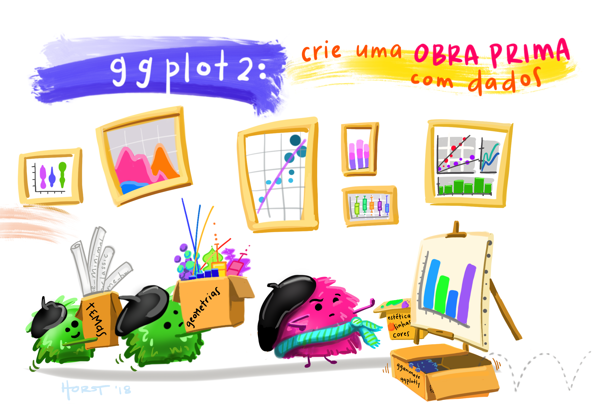

layout: true
  
<div class="my-footer"><span>


<a href="https://www.meetup.com/pt-BR/R-Ladies-Sao-Paulo">Meetup</a> |
<a href="https://twitter.com/RLadiesSaoPaulo">Twitter</a> | 
<a href="http://instagram.com/RLadiesSaoPaulo">Instagram</a> |
<a href="http://facebook.com/RLadiesSaoPaulo">Facebook</a> |
<a href="https://github.com/rladies/meetup-presentations_sao-paulo">GitHub</a> |
<a href="https://www.youtube.com/channel/UCU3ePTnZQurDkYgPK61DAOw">YouTube</a>


</span></div> 


---
class:

```{r setup, include=FALSE}
options(htmltools.dir.version = FALSE)

knitr::opts_chunk$set(fig.align = "center", message=FALSE, warning=FALSE)

library(tidyverse)
library(dados)
library(xaringan)
library(remotes)
library(DT)
library(summarytools)
library(dados)
library(friends)
```

# Programação

**Princípios de Dataviz com R e ggplot2**

- 19/out: Introdução do pacote `ggplot2`

- 20/out: Explorando gráficos com `ggplot2`

- 21/out: Storytelling com dados


```{r echo=FALSE, , fig.cap="Art by <a href='https://github.com/allisonhorst/stats-illustrations'>Allison Horst</a>", out.width="35%", fig.show='hold',fig.align='center'}
knitr::include_graphics(c("img/horst/ggplot2_exploracao_pt.png"))
```

---
class:

# Hoje

- Visualização e Exploração dos Dados

- Tipos de gráficos e exemplos com `ggplot2`

- Combinando mais de um tipo de gráfico com o `ggplot2` 

- Salvando e exportando os gráficos gerados no `ggplot2`

- Exercícios práticos

```{r echo=FALSE, , fig.cap="Art by <a href='https://github.com/allisonhorst/stats-illustrations'>Allison Horst</a>", out.width="40%", fig.show='hold',fig.align='center'}

```

---

# Pré-requisitos

## `R` e `RStudio` instalados no seu notebook 

```{r, echo=FALSE, out.width="40%"}
knitr::include_graphics("img/rlogos/rstudio-r.jpg")
```

- Instale o R [fazendo o download aqui](https://cran.r-project.org/) e o RStudio [aqui](https://rstudio.com/products/rstudio/download/#download).

## Pacote `ggplot2` e `dplyr` instalados

```{r eval=FALSE, include=TRUE}
install.packages("ggplot2") # Para instalar 
library(ggplot2) # Para carregar a biblioteca

install.packages("dplyr") # Para instalar 
library(dplyr) # Para carregar a biblioteca
```

- [Cheatsheet em português](https://www.rstudio.com/wp-content/uploads/2016/03/ggplot2-cheatsheet-portuguese.pdf)

---
class:

# Visualizar é explorar

## Características da visualização para exploração
- Usada para entender melhor o conjunto de dados
- Normalmente é feita em cima dos dados não agregados
- Ajuda a entender conceitos estatísticos
- Aparência e comunicação importam menos
- A principal audiência é quem rodou o código
- Explora o gráfico por um bom tempo

normalmente histogramas e gráficos de dispersão


<!--- JU: ADD IMAGEM DE GRÁFICOS AQUI!! ---> 

---
class: 

# Visualizar é explorar:

Para os exemplos dessa apresentação, vou usar dados da série **Friends**.  
Pra quem quiser rodar os exemplos, é só instalar o pacote `install.packages("friends")`.

.pull-left[
```{r dados_friends}
# Carregando os dados 
df_friends_info <- friends::friends_info

#Primeiras 5 linhas do dataframe
head(df_friends_info)
```
]

.pull-right[
```{r echo=FALSE, out.width="25%"}

```
]

--- 
class:

# O operador %>%, o "Pipe"

Imagine uma receita que tenha as instruções: junte os ingredientes, misture e leve ao forno. Na forma usual do R, essas instruções provavelmente seriam assim:

**forno(misture(junte(ingredientes)))**

Dessa forma temos que pensar “de dentro para fora”. O primeiro comando que lemos é forno, sendo que essa é a última operação que será realizada.

Com o operador pipe seria algo assim:

**ingredientes %>% junte %>% misture %>% forno**

É mais intuitivo!

--- 
class:

# O operador %>%, o "Pipe"

Para ficar mais fácil: pense no Pipe %>% como um operador que efetua as operações à direita nos valores que estão à esquerda.

Ou ainda, o operador %>% passa o que está à esquerda como argumento para a operação da direita.

**Atalho**: CTRL + SHIFT + M

---
class: center, middle, inverse

# Tipos de Gráficos

Utilizando os gráficos *ggplot* para explorar e visualizar dados

---
class:

# Gráfico de Histograma

Vamos avaliar como está a distribuição das notas dos episódios no IMDB?

Com o **histograma** conseguimos rapidamente ver a distribuição de frequência da coluna selecionada. 

.left-code[
```{r plot-exemplo-hist1, echo=TRUE, fig.show="hide", out.width="80%"}
df_friends_info %>% 
  ggplot(aes(season)) + 
  geom_histogram(bins=20, fill = "lightblue3") + 
  theme_minimal() +
  labs(x = "Temporada")
```

]

.right-plot[
`)
]


---
class:

# Gráfico de Histograma

## [Hands On]

- No script de apoio, gere o mesmo histograma do slide anterior

- Deixe o histograma com no máximo 10 barras e adicione um título ao gráfico

---
class:

# Gráfico de Histograma

```{r plot-exemplo-hist2, eval=FALSE, tidy=FALSE}
df_friends_info %>% 
  ggplot(aes(season)) + 
  geom_histogram(bins=10, fill = "lightblue3", color = "darkblue") + 
  theme_minimal() + 
  labs(x = "Temporada",
       title = "Quantidade de Episódios por temporada em Friends")
```

```{r echo=FALSE, fig.align='center', fig.dim=c(6,5)}
df_friends_info %>% 
  ggplot(aes(season)) + 
  geom_histogram(bins=10, fill = "lightblue3", color = "darkblue") + 
  theme_minimal() + 
  labs(x = "#Temporada",
       title = "Quantidade de Episódios por temporada em Friends")
```

---
class:

# Gráfico de Barras

Quantas visualizações cada temporada teve?

O **gráfico de barras** é utilizado para mostrar a relação entre variáveis numéricas e categóricas, então se encaixa bem nesse caso.

.left-code[
```{r plot-exemplo-barras1, echo=TRUE, fig.show="hide", out.width="70%"}
df_friends_info %>% 
  ggplot(aes(x = factor(season),
             y = us_views_millions)) + 
  geom_col() +
  theme_bw() +
  labs(title = "Alcance das temporadas",
       x = "Temporada",
       y = "Total de Visualizações (mi)")
```

]

.right-plot[
`)
]

---
class:

# Gráfico de Barras

E se a gente quebrar o volume de visualizações por nota no IMDB?

```{r, echo=TRUE, fig.show="hide", out.width="80%"}
df_friends_info <- df_friends_info %>%
  mutate(tipo_nota = ifelse(imdb_rating < 9, "0 a 9", "9 ou mais"))
```


---
class:

# Gráfico de Barras

E se a gente quebrar o volume de visualizações por nota no IMDB?


```{r plot-exemplo-barras2, eval=FALSE, tidy=FALSE}
df_friends_info %>% 
  ggplot(aes(x = factor(season), y = us_views_millions, fill = tipo_nota)) + 
  geom_col() +
  scale_fill_manual(values = c("grey", "darkgreen")) +
  theme_bw() +
  labs(title = "Alcance das temporadas de Friends")
```

```{r echo=FALSE, fig.align='center', fig.dim=c(5,4)}
df_friends_info %>% 
  ggplot(aes(x = factor(season), y = us_views_millions, fill = tipo_nota)) + 
  geom_col() +
  scale_fill_manual(values = c("grey", "darkgreen")) +
  theme_bw() +
  labs(title = "Alcance das temporadas de Friends")
```

---
class:

# Gráfico de Barras

## [Hands On]

- No script de apoio, gere os mesmos gráficos de barra

- Mude a faixa de nota do IMDB, as cores e nome da legenda

---
class:

# Gráfico de Barras

```{r plot-exemplo-barras3, eval=FALSE, tidy=FALSE}
df_friends_info <- df_friends_info %>%
  mutate(tipo_nota = case_when(imdb_rating < 8 ~ "0 a 8", 
                               imdb_rating < 9 ~ "8 a 9",
                               T ~ "9 ou mais"))
df_friends_info %>% 
  ggplot(aes(x = factor(season), y = us_views_millions, fill = tipo_nota)) + 
  geom_col() +
  scale_fill_manual(values = c("#F4E659", "#E26A50","#581845")) +
  theme_bw() +
  labs(title = "Alcance das temporadas de Friends",
       fill = "Faixa de nota")
```

```{r echo=FALSE, fig.align='center', fig.dim=c(5,3.5)}
df_friends_info <- df_friends_info %>%
  mutate(tipo_nota = case_when(imdb_rating < 8 ~ "0 a 8", 
                               imdb_rating < 9 ~ "8 a 9",
                               T ~ "9 ou mais"))
df_friends_info %>% 
  ggplot(aes(x = factor(season), y = us_views_millions, fill = tipo_nota)) + 
  geom_col() +
  scale_fill_manual(values = c("#F4E659", "#E26A50","#581845")) +
  theme_bw() +
  labs(title = "Alcance das temporadas de Friends",
       fill = "Faixa de nota")
```

---
class:

# Gráfico de Dispersão

Existe uma relação entre o número de visualizações e a nota do episódio?

O **gráfico de dispersão** mapeia pares de pontos, evidenciando a relação entre as duas variáveis analisadas:

.left-code[
```{r plot-exemplo-disp1, echo=TRUE, fig.show="hide", out.width="70%"}
df_friends_info %>% 
  ggplot(aes(x = imdb_rating,
             y = us_views_millions)) + 
  geom_point() 
```

]

.right-plot[
`)
]

---
class:

# Gráfico de Dispersão

A função `geom_smooth` facilita a inclusão de linhas de regressão dentro do gráfico. É possível escolher o método, no caso, escolhemos uma **regressão linear**:


```{r, eval=FALSE, tidy=FALSE}
df_friends_info %>% 
  ggplot(aes(x = imdb_rating,  y = us_views_millions)) + 
  geom_point() +
  geom_smooth(method = "lm")  
```

```{r echo=FALSE, fig.align='center', fig.dim=c(6,4)}
df_friends_info %>% 
  ggplot(aes(x = imdb_rating, y = us_views_millions)) + 
  geom_point() +
  geom_smooth(method = "lm") 
```

---
class:

# Gráfico de Dispersão

A regressão linear mostra um volume de visualizações maior de acordo com melhores notas, mas e como fica se aplicarmos uma **função polinomial** de segunda ordem?


```{r, eval=FALSE, tidy=FALSE}
df_friends_info %>% 
  ggplot(aes(x = imdb_rating, y = us_views_millions)) + 
  geom_point() +
  geom_smooth(formula = y ~ poly(x, 2), method = "lm")
```

```{r echo=FALSE, fig.align='center', fig.dim=c(6,4)}
df_friends_info %>% 
  ggplot(aes(x = imdb_rating, y = us_views_millions)) + 
  geom_point() +
  geom_smooth(formula = y ~ poly(x, 2), method = "lm")
```

---
class:

# Gráfico de Dispersão

## [Hands On]

- No script de apoio, gere os mesmos gráficos de dispersão mostrados aqui

- Faça um gráfico de dispersão para ver a relação entre volume de visualizações e temporada. 

- Adicione ao gráfico uma função polinomial de terceira ordem

---
class:

# Gráfico de Dispersão

```{r, eval=FALSE, tidy=FALSE}
df_friends_info %>% 
  ggplot(aes(x = season, y = us_views_millions)) + 
  geom_point() +
  geom_smooth(formula = y ~ poly(x, 3), method = "lm",
              colour = "magenta3", size = 1.5) 
```

```{r echo=FALSE, fig.align='center', fig.dim=c(6,4)}
df_friends_info %>% 
  ggplot(aes(x = season, y = us_views_millions)) + 
  geom_point() +
  geom_smooth(formula = y ~ poly(x, 3), method = "lm",
              colour = "magenta3", size = 1.5)
```

---
class:

# Gráfico de Dispersão

## Bonus

Podemos também adicionar **cores** aos pontos de acordo com uma 3ª variável:
```{r, eval=FALSE, tidy=FALSE}
df_friends_info %>% 
  ggplot(aes(x = season, y = us_views_millions)) + 
  geom_point(aes(colour = tipo_nota)) +
  geom_smooth(formula = y ~ poly(x, 3), method = "lm",
              colour = "magenta3", size = 1.5)
```

```{r echo=FALSE, fig.align='center', fig.dim=c(6,4)}
df_friends_info %>% 
  ggplot(aes(x = season,  y = us_views_millions)) + 
  geom_point(aes(colour = tipo_nota)) +
  geom_smooth(formula = y ~ poly(x, 3), method = "lm",
              colour = "magenta3", size = 1.5) 
```

---
class:

# Gráfico de Dispersão

## Bonus

E definir as **formas** dos pontos de acordo com uma 3ª variável:
```{r, eval=FALSE, tidy=FALSE}
df_friends_info %>% 
  ggplot(aes(x = season, y = us_views_millions)) + 
  geom_point(aes(colour = tipo_nota, shape = tipo_nota), size = 2.5) +
  geom_smooth(formula = y ~ poly(x, 3), method = "lm",
              colour = "magenta3", size = 1.5) 
```

```{r echo=FALSE, fig.align='center', fig.dim=c(6,4)}
df_friends_info %>% 
  ggplot(aes(x = season, y = us_views_millions)) + 
  geom_point(aes(colour = tipo_nota, shape = tipo_nota), size = 2.5) +
  geom_smooth(method = "lm", formula = y ~ poly(x, 3), 
              colour = "magenta3", size = 1.5)
```

---
class:

# Gráfico de Box-plot

O **gráfico de Box-plot** é um diagrama de caixa que evidencia os quartis das variáveis, além de apontar eventuais outliers:
```{r eval=FALSE, tidy=FALSE}
ggplot(df_friends_info,
       aes(x = factor(season), y = us_views_millions, fill = factor(season))) + 
  geom_boxplot()
```
```{r echo=FALSE, fig.align='center', fig.dim=c(7,4.8)}
ggplot(df_friends_info,
       aes(x = factor(season), 
           y = us_views_millions,  
           fill = factor(season))) + 
  geom_boxplot()
```

---
class:

# Gráfico de Box-plot

Para enriquecer nosso gráfico com novas camadas, vamos gerar tabelas auxiliares com:

- *Média* e *mediana* de visualizações por temporada

```{r}
# Agrupa os dados para pegar a média e mediana
df_friends_agrup <- df_friends_info %>% 
  dplyr::group_by(season) %>% 
  dplyr::summarise(media_visu = mean(us_views_millions),
                   mediana_visu = median(us_views_millions))
```

- *2 episódios mais assistidos* (outliers encontrados no boxplot anterior)

```{r}
# Seleciona os 2 episódios mais assistidos 
top_2 <- df_friends_info %>% 
  arrange(desc(us_views_millions)) %>% 
  select(season, title, us_views_millions) %>% 
  distinct() %>%
  head(2)  
```

---
class:

# Gráfico de Box-plot

Vamos adicionar uma camada com pontos com a *média de visualizações*:
```{r, eval=FALSE, tidy=FALSE}
gg <- ggplot(df_friends_info, aes(x = factor(season),  y = us_views_millions, 
                            fill = factor(season))) + 
  geom_boxplot() +
  geom_point(data = df_friends_agrup, aes(x = factor(season), y = media_visu), 
             colour = "yellow", size = 2)
```

```{r echo=FALSE, fig.align='center', fig.dim=c(7,4.8)}
gg <- ggplot(df_friends_info, aes(x = factor(season),  y = us_views_millions, 
                            fill = factor(season))) + 
  geom_boxplot() +
  geom_point(data = df_friends_agrup, aes(x = factor(season), y = media_visu), 
             colour = "yellow", size = 2)

print(gg)
```

---
# Gráfico de Box-plot

Agora, adicionaremos uma *camada* que exibe a mediana como texto:
```{r, eval=FALSE, tidy=FALSE}
gg2 <- gg +
  geom_text(data = df_friends_agrup, 
             aes(x = factor(season), y = mediana_visu, 
                 label = format(mediana_visu, digits = 1, nsmall = 1)),
             fontface = "bold", size = 3, vjust = -0.5)
```

```{r echo=FALSE, fig.align='center', fig.dim=c(7,4.5)}
gg2 <- gg +
  geom_text(data = df_friends_agrup, 
             aes(x = factor(season), y = mediana_visu, 
                 label = format(mediana_visu, digits = 1, nsmall = 1)),
             fontface = "bold", size = 3, vjust = -0.5)
print(gg2)
```

---
# Gráfico de Box-plot

Adicionaremos também uma *camada* com o título dos 2 episódios outliers
```{r, eval=FALSE, tidy=FALSE}
gg3 <- gg2 +
  geom_label(data = top_2, 
             aes(x = factor(season), y = us_views_millions, 
                 label = title),
             fill = "white", size = 2.5)
```

```{r echo=FALSE, fig.align='center', fig.dim=c(7,4.5)}
gg3 <- gg2 +
  geom_label(data = top_2, 
             aes(x = factor(season), y = us_views_millions, 
                 label = title),
             fill = "white", size = 2.5)
print(gg3)
```

---
class:

# Gráfico de Box-plot

## [Hands On]

- No script de apoio, gere os mesmos gráficos mostrados aqui :)

- Altere o gráfico para mostrar o título dos 3 episódios mais visualizados

---
# Gráfico de Box-plot

```{r, eval=FALSE, tidy=FALSE}
top_3 <- df_friends_info %>% 
  arrange(desc(us_views_millions)) %>% 
  select(season, title, us_views_millions) %>% 
  distinct() %>% head(3)  

gg2 + geom_label(data = top_3, 
             aes(x = factor(season), y = us_views_millions, label = title),
             fill = "white", size = 2.5)
```

```{r echo=FALSE, fig.align='center', fig.dim=c(7,4.5)}
top_3 <- df_friends_info %>% 
  arrange(desc(us_views_millions)) %>% 
  select(season, title, us_views_millions) %>% 
  distinct() %>% head(3) 

gg2 +
  geom_label(data = top_3, 
             aes(x = factor(season), y = us_views_millions, 
                 label = title),
             fill = "white", size = 2.5)
```

---
class:

# Gráfico de Linhas

Vamos utilizar o **gráfico de linhas** para visualizar o volume de visualizações por data de lançamento dos episódios:
```{r eval=FALSE, tidy=FALSE}
gglinhas <- df_friends_info %>% 
  ggplot() +
  geom_line(aes(x = air_date, y = us_views_millions, color = factor(season))) +
  theme_dark()
```

```{r echo=FALSE, fig.align='center', fig.dim=c(7,4.5)}
df_friends_info %>% 
  ggplot() +
  geom_line(aes(x = air_date, y = us_views_millions, color = factor(season))) +
  theme_dark()
```

---
class:

# Salvando e exportando os gráficos

Para exportar qualquer um dos gráficos gerados, podemos usar a função **ggsave**
```{r eval=FALSE, tidy=FALSE}
ggsave("graf_linhas.png", plot = gglinhas)
```

---
class:    

# Referências e Dicas

- [Workshop Code Your Graph](https://alison.rbind.io/html/jamboree_heart_ggplot.html)

- [R for Data Science - capítulos 3 e 28](https://r4ds.had.co.nz/data-visualisation.html)

- [Cheatsheets RStudio](https://www.rstudio.com/resources/cheatsheets/)

- Apresentação feita com o pacote [xaringan](https://github.com/yihui/xaringan), e o tema `metropolis` modificado por [Bea Milz](https://beatrizmilz.com).

- Apresentação inspirada na apresentação da [Letícia Thomaz](https://lodthomaz.github.io/ggplot2_RLadiesSP/)
